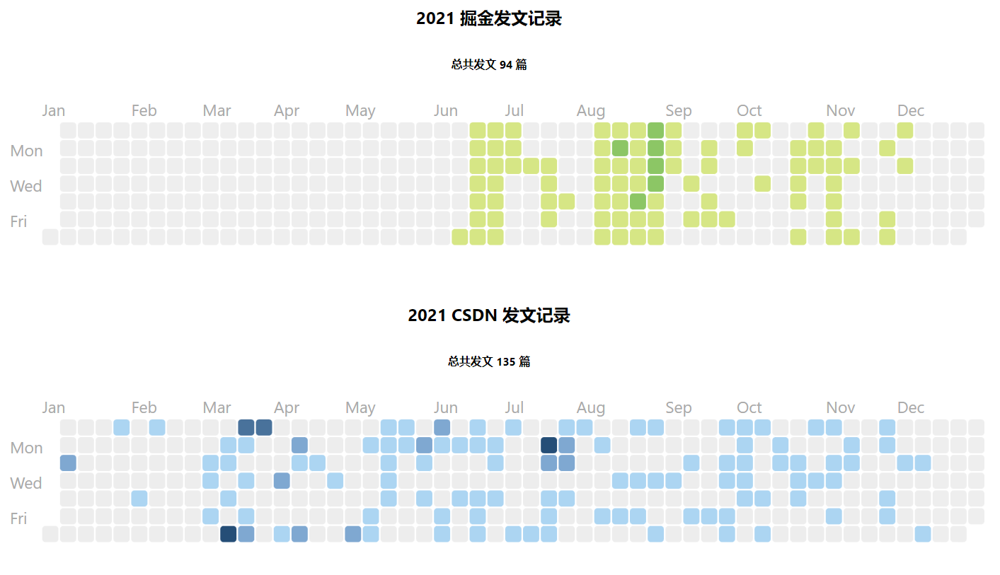

<h2 align="center">👋 欢迎访问我的 article-calendar 仓库</h2>
<h4 align="center">联系我</h4>
<p align="center"></p>
<h4><p align="center">💖 大二 @GDUT 💞 前端 💟 Base: 广州</p></h4>
<h5><p align="center"><i>本项目基于 react-calendar-heatmap 开源项目而制作</i></p></h5>

# 本项目最终呈现效果



## 如何使用本项目

1. clone 本项目到本地

```shell
git clone git@github.com:linjunc/article-calendar.git
```

2. 执行 `yarn` 或 `yarn install` 安装项目相关依赖
3. 导入账号 `json` 数据

掘金的所有文章数据可以在下面这个接口获取，`uid` 是点开个人主页 `url` 后面的那一长串数字

```shell
https://e0b75de1-90c7-4c11-9d12-a8bc84c4d081.bspapp.com/http/jjskyline?uid=你的掘金uid
```

4. 在地址栏输入上面的 `url` 后会下载一个 `json` 文件
5. 替换项目文件中的 `assets/article.json` 文件
6. 执行 `yarn start` 命令，即可生成！

如果你喜欢本项目，欢迎 `star`

如何获取 CSDN 文章数据
直接拿到浏览器打开，如果文章多的话可以更改 `size`对应的值，获取到json后，下载既可

下载完成后，将 json 替换 `assets/article-csdn.json` 文件，即可
需要注意的是拿到的 `json` 是 下面这个格式，只需要把 list 字段对应的数组复制即可
特别注意：CSDN 一次最多返回 100 条数据，因此如果超过100篇，可以将 `page` 改成 2，将获取到的 `list` 数组，加到 `json` 文件中
```json
    {
        "code":200,
        "message":"success",
        "data":{
            "list": [
                {},
                {}
            ]
        }
    }
```

```shell
https://blog.csdn.net/community/home-api/v1/get-business-list?page=1&size=150&businessType=blog&orderby=&noMore=false&year=2021&month=&username=你的CSDNid
```
