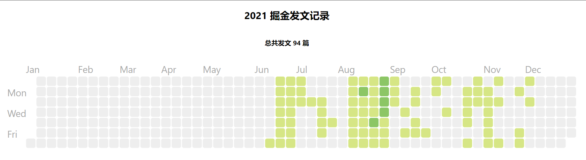

<h2 align="center">👋 欢迎访问我的 article-calendar 仓库</h2>
<h4 align="center">联系我</h4>
<p align="center"></p>
<h4><p align="center">💖 大二 @GDUT 💞 前端 💟 Base: 广州</p></h4>
<h5><p align="center"><i>本项目基于 react-calendar-heatmap 开源项目而制作</i></p></h5>

# 本项目最终呈现效果



## 如何使用本项目

1. clone 本项目到本地

```shell
git clone git@github.com:linjunc/article-calendar.git
```

2. 执行 `yarn` 或 `yarn install` 安装项目相关依赖
3. 导入账号 `json` 数据

掘金的所有文章数据可以在下面这个接口获取，`uid` 是点开个人主页 `url` 后面的那一长串数字

```shell
https://e0b75de1-90c7-4c11-9d12-a8bc84c4d081.bspapp.com/http/jjskyline?uid=你的掘金uid
```

4. 在地址栏输入上面的 `url` 后会下载一个 `json` 文件
5. 替换项目文件中的 `assets/article.json` 文件
6. 执行 `yarn start` 命令，即可生成！

如果你喜欢本项目，欢迎 `star`

